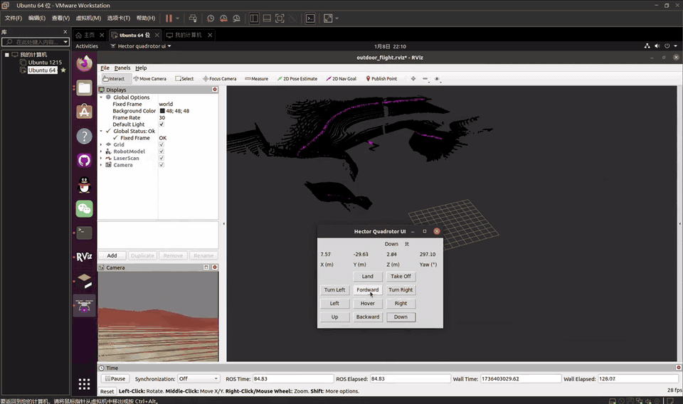

# AeroSLAM

**Simulation, SLAM, planning and control for aerial and ground robots on ROS 1 Noetic.**

<p align="center">
  <a href="https://github.com/"></a>
  
  
  
  
</p>

<p align="center">
  
</p>

<p align="center"><a href="docs/media/demo.mp4">Full demo video (1 min 52 s)</a></p>

AeroSLAM flies a quadrotor and navigates ground robots in ROS 1 Noetic simulation:
it runs hector_quadrotor's position/velocity/attitude control with EKF pose
estimation and takeoff/landing/pose actions in Gazebo, builds maps with
hector_mapping 2D SLAM and FAST-LIO LiDAR-inertial odometry on a simulated Livox
LiDAR, plans and tracks trajectories with A\*, Hybrid A\*, Sunshine sampling,
iLQR, corridor-MPC, reachability-MPPI and minimum-snap optimizers, drives ground
robots through 2D costmaps with ESDF, Voronoi, reachability and social layers,
and computes WGS-84/UTM geodesy, geographic messages and UUIDs.

## Repository layout

```
AeroSLAM/
├── src/
│   ├── common/                  # reusable libraries & tools (BSD-3)
│   │   ├── geographic_info/     #   geodesy (WGS-84/UTM), geographic_msgs
│   │   ├── unique_identifier/   #   unique_id, uuid_msgs
│   │   └── teleop_twist_keyboard/
│   ├── uav/                     # aerial robot stacks
│   │   ├── hector_quadrotor/    #   sim, control, estimation, actions, demos
│   │   ├── hector_gazebo/       #   gazebo plugins & worlds       (vendored)
│   │   ├── hector_models/       #   descriptions                   (vendored)
│   │   ├── hector_localization/ #   EKF pose estimation            (vendored)
│   │   └── hector_slam/         #   2D SLAM + geotiff              (vendored)
│   ├── ground/                  # ground robot navigation (GPL-3.0)
│   │   ├── core/                #   planners / controllers / optimizers
│   │   ├── plugins/             #   costmap layers & gazebo plugins
│   │   ├── sim_env/             #   worlds, robots, maps, RViz
│   │   └── images/              #   demo animations (optimized)
│   └── frontier/                # SOTA modules, fetched (see its README)
├── thirdparty/
│   ├── aeroslam.repos           # vcstool manifest (FAST-LIO, Livox, ego-planner…)
│   ├── patches/                 # per-module compatibility patches
│   └── LBFGS-Lite/              # vendored header-only optimizer
├── scripts/                     # setup / build / test / run / format
├── docker/                      # Noetic image + compose
├── docs/                        # architecture, refactor notes, module docs
└── .github/                     # CI
```

## Quick start

> Requirements: Ubuntu 20.04 + ROS Noetic (`ros-noetic-desktop-full`) + Gazebo 11.

```bash
git clone https://github.com/<your-org>/AeroSLAM.git && cd AeroSLAM

./scripts/setup.sh                 # apt + rosdep (OSQP, glog, PCL …)
./scripts/setup.sh --with-frontier # optional: fetch FAST-LIO / Livox modules
./scripts/build.sh                 # build the whole workspace

# aerial
./scripts/run_uav_sim.sh empty                 # Gazebo empty world + quadrotor
./scripts/run_uav_sim.sh indoor-slam           # hector_mapping indoor demo
./scripts/run_uav_sim.sh outdoor-flight        # outdoor flight demo
./scripts/run_uav_sim.sh teleop                # joystick teleop

# ground
./scripts/run_ground_sim.sh                    # test2 world, HLP+MPC+corridor
./scripts/run_ground_sim.sh --world warehouse  # warehouse world + pedestrians

./scripts/test.sh                              # gtest + nosetests, full workspace
```

Docker: `docker compose -f docker/docker-compose.yml up --build`.

## Modules

### Aerial (`src/uav`)

| Package group | Role |
|---|---|
| `hector_quadrotor_*` | dynamics model, Gazebo plugins, ros_control cascade (position → velocity → attitude), hardware sim, actions, teleop, demos |
| `hector_localization` | `hector_pose_estimation` EKF + `message_to_tf`; consumes `geographic_msgs` |
| `hector_gazebo` / `hector_models` / `hector_slam` | sensor plugins & worlds, robot descriptions, 2D SLAM + geotiff mapping |

### Ground (`src/ground`)

| Module | Contents |
|---|---|
| `core/path_planner` | A\*, Hybrid A\*, reachability planner, Sunshine ray-sampling planner |
| `core/controller` | HLP+MPC+convex-corridor, iLQR, reachability MPPI (+ legacy nav_core plugins) |
| `core/trajectory_planner` | conjugate gradient, L-BFGS, minimum-snap (OSQP) |
| `core/common` | geometry, Dubins/Reeds-Shepp/Bézier curves, convex safety corridor, KD-tree |
| `plugins/map_plugins` | distance (ESDF), Voronoi, global/local reachability, social layers |
| `sim_env` | Gazebo worlds (test2, warehouse + pedestrians), TurtleBot3/nanocar, RViz |

### Common (`src/common`)

`geodesy` (WGS-84 ⇄ UTM), `geographic_msgs`, `uuid_msgs`/`unique_id`,
`teleop_twist_keyboard`.

### Frontier (`src/frontier`)

Pinned by `thirdparty/aeroslam.repos`, fetched on demand, patched automatically
where needed (currently `livox_laser_simulation` for Gazebo Classic 11 and
`FAST_LIO` build order). Verified buildable today: **FAST-LIO**,
**livox_ros_driver**, **livox_laser_simulation**; EGO-Planner / FUEL / OctoMap
are pinned for the next milestone. See `src/frontier/README.md`.

## Results

Verified on Ubuntu 20.04 / ROS Noetic (headless simulation):

| Check | Result |
|---|---|
| Full workspace build (aerial + ground + frontier) | pass |
| `catkin_make run_tests` | 166 tests, 0 failures |
| Livox chain (`/livox/lidar_sim` → `/livox/lidar`) | 10 Hz |
| IMU chain (`/livox/imu`) | 100 Hz |
| FAST-LIO odometry rate | 10 Hz |
| LIO drift vs ground truth (3 runs, 40-45 s flights) | RMSE 0.13-0.16 m, aligned 0.06-0.08 m (`docs/technical-report.md`) |
| Ground navigation goal (test2, A\*+HLP+MPC+corridor) | reached in 14.0 s, final error 0.44 m |
| EGO-Planner closed loop | 5 m goal reached, trajectory commands at 100 Hz |


Reproduce: `python3 tools/benchmark/run_lio_benchmark.py --duration 45 --runs 1`.
System architecture (vector PDF): [`docs/media/figures/fig1_architecture.pdf`](docs/media/figures/fig1_architecture.pdf).

## Documentation

- `docs/technical-report.md` — system, verification methodology and measured results
- `src/ground/docs/` — HLP+MPC+corridor paper notes, Sunshine planner, reachability planner
- `src/frontier/README.md` — frontier fetch/patch/status

## Roadmap

- [x] Monorepo (aerial + ground + common) with preserved upstream history
- [x] Build modernization: Conan removal, format-2 manifests, Python 3, CI, Docker
- [x] Upstream bug fixes; test suite green (166 tests)
- [x] Frontier build pipeline: FAST-LIO + Livox modules compile in-workspace
- [x] `aeroslam_bringup`: Livox LiDAR + FAST-LIO odometry on the hector quadrotor
      (verified headless: LiDAR 10 Hz, IMU 100 Hz, odometry 10 Hz)
- [x] Benchmark tooling: reproducible LIO benchmark with ground-truth comparison
- [x] EGO-Planner closed-loop flight: trajectory commands at 100 Hz and a 5 m
      goal reached on the hector quadrotor (headless-verified)
- [x] Ground benchmark: map-picked goal reached in 14 s (0.44 m final error)
- [x] Exploration tutorial + baseline frontier explorer
- [ ] Multi-scenario benchmark matrix (planners x worlds)

## License

AeroSLAM is distributed under **GPL-3.0** (see `LICENSE`). Upstream components
keep their original licenses (mostly BSD-3); see `NOTICE.md` for exact
attribution, including the imported upstream revisions.

## Acknowledgements

Standing on the shoulders of: `hector_quadrotor` and the TU Darmstadt
`hector_*` stacks, `robot_path_planner_public` / `ros_motion_planning`,
`geographic_info`, `unique_identifier`, `teleop_twist_keyboard`, FAST-LIO,
Livox SDK simulation, EGO-Planner and the wider ROS community.
