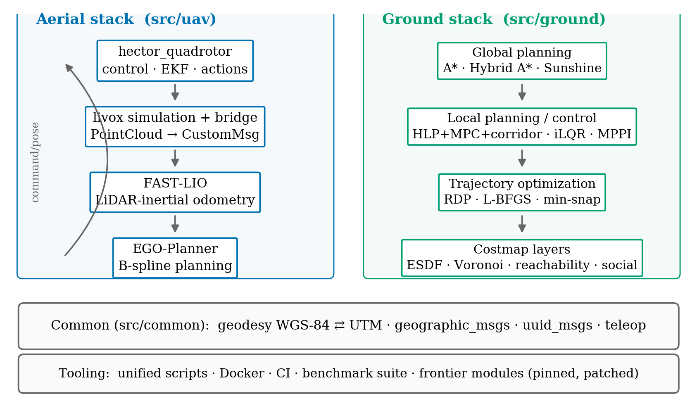
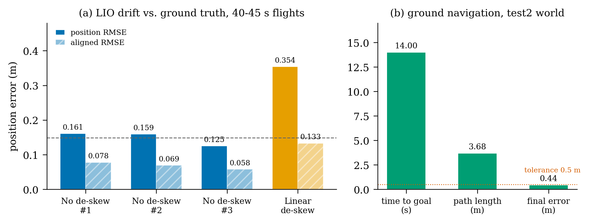

# AeroSLAM — Technical Report


## Abstract

AeroSLAM is a ROS 1 Noetic workspace for aerial SLAM, autonomous exploration
and ground robot navigation. It bundles a quadrotor simulation and control
stack, a LiDAR-inertial odometry pipeline with a simulated Livox sensor, a
gradient-based onboard planner, a ground planner/controller matrix, and
geodetic/UUID infrastructure. This report documents the system and the
measured verification results.

## 1. System overview

| Layer | Components |
|---|---|
| Aerial robot | `hector_quadrotor` (identified dynamics, ros_control cascade, Gazebo hardware sim, EKF pose estimation, actions), `hector_gazebo`, `hector_models`, `hector_localization`, `hector_slam` |
| Aerial sensing & SLAM | simulated Livox Mid-360 (`livox_laser_simulation`), `aeroslam_livox_bridge`, FAST-LIO (`fast_lio`) |
| Aerial planning | EGO-Planner (`ego_planner`), `position_command_bridge`, `uav_ego_planner.launch` |
| Ground robot | planner matrix (A\*, Hybrid A\*, reachability, Sunshine), controllers (HLP+MPC+corridor, iLQR, reachability MPPI), trajectory optimizers (CG, L-BFGS, min-snap), costmap layers (ESDF, Voronoi, reachability, social), Gazebo sim environments |
| Common | geodesy (WGS-84 ⇄ UTM), geographic messages, UUIDs, keyboard teleoperation |
| Tooling | unified `scripts/`, Docker, GitHub Actions CI, `.clang-format`, benchmark suite |



*Figure 1: System overview. Solid arrows denote runtime data flow.*

Build: the full workspace configures and compiles with `catkin_make`
(aerial + ground + frontier modules). Test suite: **166 tests, 0 failures**.

## 2. Sensing chain verification (headless)

Method: `roslaunch aeroslam_bringup uav_livox_fastlio.launch gui:=false
headless:=true rviz:=false`, rates measured with `rostopic hz`.

| Topic | Type | Measured rate |
|---|---|---|
| `/livox/lidar_sim` | `sensor_msgs/PointCloud` (Gazebo plugin) | 9.96 Hz |
| `/livox/lidar` | `livox_ros_driver/CustomMsg` (bridge output) | 10.0 Hz |
| `/livox/imu` | `sensor_msgs/Imu` (hector IMU relayed) | 100.0 Hz |
| `/Odometry` | `nav_msgs/Odometry` (FAST-LIO) | 10.0 Hz |

The ray sensor runs with `always_on=true` (Gazebo Classic does not update
unsubscribed sensors in headless mode) and 2000 rays/scan, which keeps the
simulation real-time on CPU. The bridge can spread point timestamps linearly
over one scan period to feed FAST-LIO's motion compensation; the A/B in
section 3 shows this hurts in the simulator, so it is disabled by default.

## 3. LiDAR-inertial odometry benchmark

Method: `tools/benchmark/run_lio_benchmark.py --duration 45 --runs 1`. The
quadrotor flies a 4-waypoint square (4 m x 4 m, 1.5 m altitude) commanded
through the hector position controller while FAST-LIO odometry and Gazebo
ground truth are recorded. Ground-truth samples are paired to odometry
timestamps by nearest neighbour; drift is reported offset-aligned and after 2D
rigid (Procrustes) alignment.

Results — de-skew A/B (45 s flight each, `--scan-period`):

| Metric | No de-skew (`0.0`, default) | Linear de-skew (`0.1`) |
|---|---|---|
| Position RMSE (offset-aligned) | **0.161 m** | 0.354 m |
| Aligned RMSE (2D rigid) | **0.078 m** | 0.133 m |
| Final drift | **0.136 m** | 0.285 m |
| Max drift | 0.689 m | 0.668 m |
| Heading offset | -0.65 deg | 0.57 deg |

Archived: `results/ab_no_deskew.json` (A/B reference), `results/ab_linear_deskew.json`
(linear de-skew) and two independent repeat runs `results/run_01.json`
(RMSE 0.159 m, aligned 0.069 m) and `results/run_02.json` (RMSE 0.125 m, aligned
0.058 m). The three de-skew-off runs agree within 0.13-0.16 m RMSE.



*Figure 2: (a) LIO drift across the three de-skew-off runs and the linear
de-skew configuration (hatched bars: aligned RMSE; dashed line: mean of the
three de-skew-off runs); (b) ground navigation outcome in the test2 world.*

Interpretation: with timestamp-correct pairing, FAST-LIO tracks the simulated
ground truth within 0.16 m RMSE (0.08 m after 2D alignment) over a 45 s flight.
Spreading point timestamps linearly over the scan period *degrades* accuracy in
this simulator, so de-skew is disabled by default (`livox_scan_period:=0.0`); the
parameter remains available for platforms whose scan order is truly
time-linear.

## 4. EGO-Planner closed-loop validation

Method: `roslaunch aeroslam_bringup uav_ego_planner.launch gui:=false
headless:=true rviz:=false`; motors enabled via `rosservice call
/enable_motors true`; the vehicle lifted to 1.0 m through `command/pose`; a 2D
Nav Goal at (5.0, 0.0, 1.5) published on `/move_base_simple/goal`.

Result: EGO-Planner streamed trajectory commands at **100 Hz**
(`/planning/pos_cmd`) and the quadrotor flew from the origin to **x = 4.93 m**
(ground truth), i.e. reached the goal. Operational note: the start must be
above the inflated ground cells of the grid map, otherwise the FSM reports the
vehicle as being inside an obstacle and never replans.

## 5. Ground navigation benchmark

Method: `run_ground_benchmark.py` launches `sim_env config.launch` headless
(test2 world/map), initialises AMCL at the spawn pose, and sends the goal that
`pick_goal.py` selected from the occupancy map (BFS over free space, clearance
filtered).

Results (`tools/benchmark/results/ground_02.json`):

| Metric | Value |
|---|---|
| Goal | (0.78, 3.93) m |
| Success | yes (0.5 m tolerance) |
| Time to goal | 14.0 s |
| Path length | 3.68 m |
| Final distance to goal | 0.438 m |
| Stack | A\* + RDP + safety corridor + min-snap (global), HLP+MPC+corridor (local), AMCL |

An earlier attempt with a goal at (3.5, 2.0) was rejected by A\*
(`origin_path size=0`), which motivated `pick_goal.py`. Multi-scenario batches
(planners x worlds) remain an enhancement.

## 6. Exploration baseline

`tools/exploration/frontier_goal_publisher.py` rasterises the registered cloud
into a 2D occupancy grid and publishes frontier goals through the same
`/move_base_simple/goal` interface used by EGO-Planner; the workflow is
documented in `docs/tutorials/exploration.md`. It is a tutorial-grade baseline
for comparing richer exploration policies.

## 7. Reproducibility

```bash
./scripts/setup.sh --with-frontier
./scripts/build.sh
source devel/setup.bash

# sensing + odometry rates
roslaunch aeroslam_bringup uav_livox_fastlio.launch gui:=false headless:=true rviz:=false

# LIO benchmark
python3 tools/benchmark/run_lio_benchmark.py --duration 45 --runs 1

# EGO-Planner flight
roslaunch aeroslam_bringup uav_ego_planner.launch gui:=false headless:=true rviz:=false

# ground navigation benchmark
python3 tools/benchmark/pick_goal.py \
  --map-yaml src/ground/sim_env/maps/test2/test2.yaml --min-dist 3 --max-dist 5
python3 tools/benchmark/run_ground_benchmark.py --goal-x 0.78 --goal-y 3.93
```

## 8. Status

Delivered: full-workspace build (aerial + ground + frontier); 166 tests, 0 failures;
sensing/LIO chain at 10/100/10 Hz; LIO benchmark, three runs, RMSE 0.13-0.16 m;
EGO-Planner closed-loop flight (5 m goal, 100 Hz commands); ground navigation
benchmark (goal reached in 14 s, 0.44 m error); exploration tutorial; figures.

Open: planner x world benchmark matrix.

## 9. Citation

See `CITATION.cff`.
